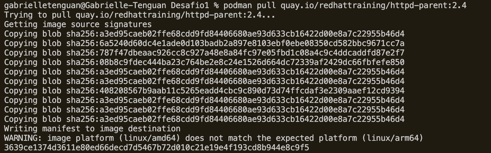
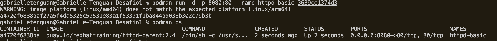
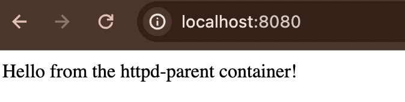
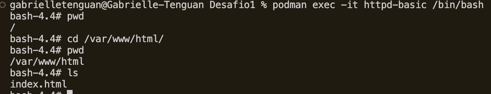
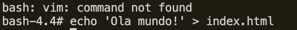
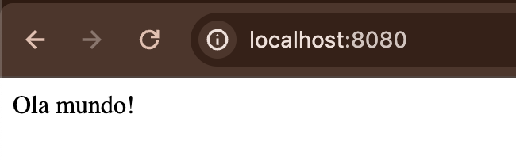
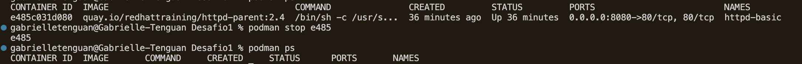

## Desafio 1 

### Comandos utilizados 

1. Baixando a imagem   
`podman pull quay.io/redhattraining/httpd-parent:2.4` -> onde imagem:tag_imagem  

2. Verificando na lista de imagens  
`podman images`  

3. Criando o container  
`podman run -d -p 8080:80 --name httpd-basic <id_imagem>`  
-d : rodar no background (daemon)   
-p : expondo a porta 8080:80   
--name : adicionando nome ao container  

4. Verificando se o container subiu  
 `podman ps`  
 !

5. Entrando no bash do container   
 `podman exec -it httpd-basic /bin/bash`  

6. Entrando na pasta /var/www/html/ para verificar se existe o index.html  
`cd /var/www/html/`  
`ls`  -> listar o conteúdo de dentro da pasta  

7. Alterando o conteúdo de dentro do index.html  
`echo 'Ola mundo!' > index.html`  

8. Parando o container que foi iniciado   
`podman ps`-> para ver o id do container rodando   
`podman stop <id>`
! 
